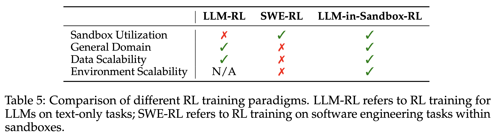

# LLM-in-Sandbox-RL

Reinforcement learning training for [LLM-in-Sandbox](https://github.com/llm-in-sandbox/llm-in-sandbox).

<p align="left">
  <a href="https://llm-in-sandbox.github.io">🌐 Project Page</a> •
  <a href="https://arxiv.org/abs/2601.16206">📄 Paper</a> •
  <a href="https://huggingface.co/datasets/daixuancheng/llm-in-sandbox-rl">🤗 Dataset</a>
</p>

## Overview

LLM-in-Sandbox-RL trains LLM agents to explore within a code sandbox (a virtual computer) for solving non-code tasks. Using only non-agentic data, the RL training incentives models to spontaneously leverage external resources, the file system, and script execution, generalizing across mathematics, physics, chemistry, biomedicine, long-context understanding, and instruction following.

<p align="left">
  
</p>


## Installation
**Requirements:** Python 3.10+, [Docker](https://docs.docker.com/engine/install/)

```bash
git clone https://github.com/llm-in-sandbox/llm-in-sandbox-rl.git
cd llm-in-sandbox-rl

pip install vllm==0.10.0 # Or install vllm from source: https://docs.vllm.ai/en/latest/
pip install flash-attn --no-build-isolation
pip install --no-deps -e verl/
pip install -e .

# Fix opencv (needed by verl)
pip install opencv-python opencv-fixer && \
    python -c "from opencv_fixer import AutoFix; AutoFix()"
```

## Quick Start

### 1. Prepare Data

Convert HuggingFace datasets to rllm training format:

```bash
python examples/llm_in_sandbox/convert_llm_sandbox_dataset.py --all --output-dir ./data
```

### 2. Train

```bash
export WANDB_API_KEY=your_wandb_key
bash examples/llm_in_sandbox/train_llm_in_sandbox.sh
```

Key training parameters (edit the script to customize):

| Parameter | Default | Description |
|-----------|---------|-------------|
| `MODEL_PATH` | `Qwen/Qwen3-4B-Instruct-2507` | Base model |
| `DOCKER_IMAGE` | `cdx123/llm-in-sandbox:v0.1` | Sandbox Docker image |
| `TRAIN_FILES` | `instruct_pretrain` | Training data |
| `VAL_FILES` | `math_mini, biomed_mini, long_context_mini` | Validation data |
| `PROMPT_LENGTH` | 16384 | Max prompt tokens |
| `RESPONSE_LENGTH` | 65536 | Max response tokens |
| `MAX_STEPS` | 100 | Max agent steps per episode |
| `rllm.env.name` | `llm_in_sandbox` | Environment name |
| `rllm.agent.name` | `llm_in_sandbox_agent` | Agent name |
| `rllm.tool_parser_type` | `hermes` | vLLM tool parser name (e.g., `qwen3_coder` for Qwen3-Coder) |

**Online Validation**

During training, we validate on a small subset of [LLM-in-Sandbox Bench](https://github.com/llm-in-sandbox/llm-in-sandbox/blob/main/llm_in_sandbox/benchmark/README.md) (math, biomed, long_context) for a quick trend check. For physics and long_context, we use rule-based reward functions (math-verify and Rouge) instead of LLM-as-a-Judge — these scores are **approximate** and only useful for tracking training progress.

> To get accurate final results, evaluate the trained model on the full benchmark, as detailed below.

### 3. Evaluate
**(a). Transfer verl checkpoints to Huggingface's**
```bash
MODEL=./exp/llm_sandbox_Qwen3-4B-Instruct-2507/global_step_150

python -m verl.model_merger merge --backend fsdp --local_dir ${MODEL}/actor --target_dir ${MODEL}/merged_hf_model
```

**(b). Evaluate**  
See [LLM-in-Sandbox Benchmark](https://github.com/llm-in-sandbox/llm-in-sandbox/blob/main/llm_in_sandbox/benchmark/README.md).

## Key Files

- [rllm/environments/llm_in_sandbox/llm_in_sandbox_env.py](./rllm/environments/llm_in_sandbox/llm_in_sandbox_env.py) — Gym-like environment wrapping `DockerRuntime` from llm-in-sandbox
- [rllm/agents/llm_in_sandbox_agent.py](./rllm/agents/llm_in_sandbox_agent.py) — Agent that converts model outputs into tool calls (`execute_bash`, `str_replace_editor`, `submit`)
- [examples/llm_in_sandbox/train_llm_in_sandbox.sh](./examples/llm_in_sandbox/train_llm_in_sandbox.sh) — Training script
- [examples/llm_in_sandbox/convert_llm_sandbox_dataset.py](./examples/llm_in_sandbox/convert_llm_sandbox_dataset.py) — Data conversion script

## Acknowledgment

Built on [DeepSWE](https://github.com/rllm-org/rllm/tree/main/examples/swe), [rLLM](https://github.com/rllm-org/rllm) and [verl](https://github.com/volcengine/verl). Thanks for the excellent frameworks.

## Citation
If you find our work helpful, please cite us:
```bibtex
@article{cheng2026llm,
  title={LLM-in-Sandbox Elicits General Agentic Intelligence},
  author={Cheng, Daixuan and Huang, Shaohan and Gu, Yuxian and Song, Huatong and Chen, Guoxin and Dong, Li and Zhao, Wayne Xin and Wen, Ji-Rong and Wei, Furu},
  journal={arXiv preprint arXiv:2601.16206},
  year={2026}
}
```